# BACRE-I  
### Battery for Assessment of Computerized Recognition of Emotion  

BACRE-I is a multimodal computerized assessment battery developed to evaluate emotion recognition and visual attention in school-aged children (8–12 years).

The system integrates static and dynamic facial stimuli, vocal emotional cues, audiovisual contexts, personalized 3D avatars generated in Unity, and infrared eye-tracking technology to provide objective metrics of socio-emotional processing.

Unlike traditional emotion recognition instruments that rely exclusively on accuracy scores, BACRE-I combines behavioral performance with gaze-based attention analysis, increasing ecological validity and experimental precision in real-world school environments.

---

## Core Components

- Multimodal emotional stimuli (static, dynamic, vocal, audiovisual)  
- Avatar-based self-referential emotional interaction  
- Infrared eye-tracking integration  
- Fixation density and reaction-time metrics  
- Empirical validation in public school settings  

---

  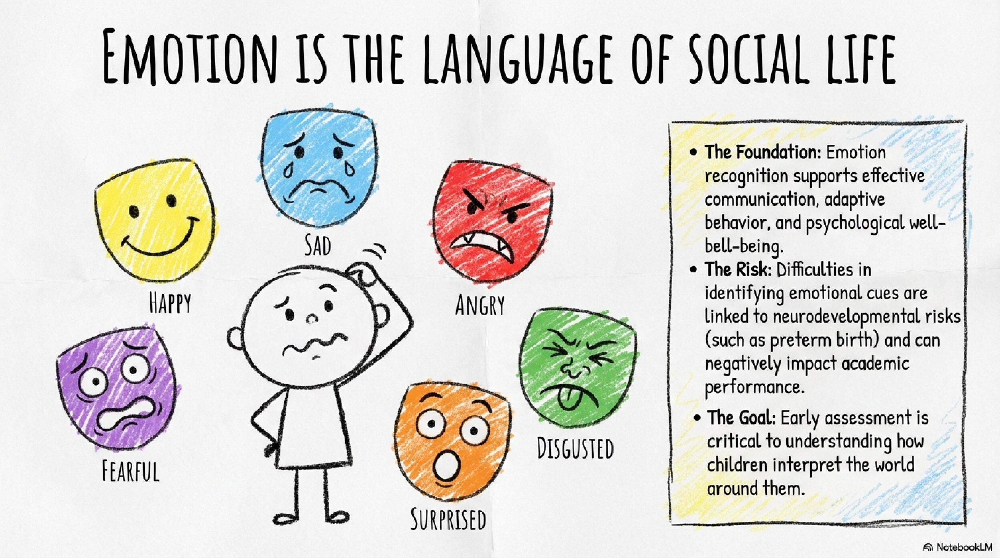

---

## Emotion is the Language of Social Life

  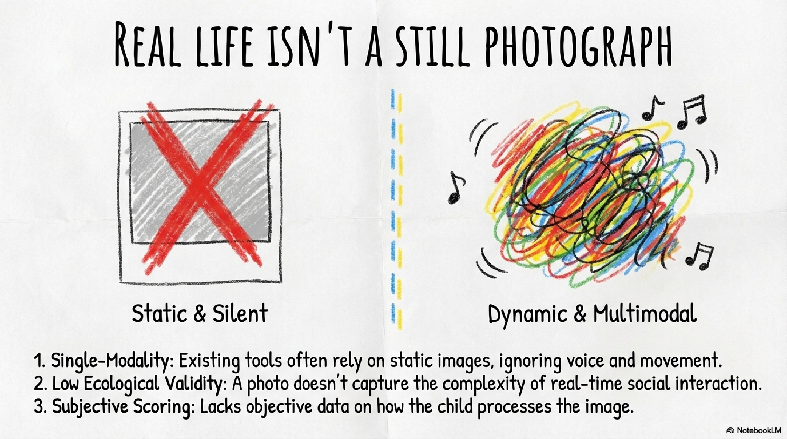

---

## Real Life Is Not Static

  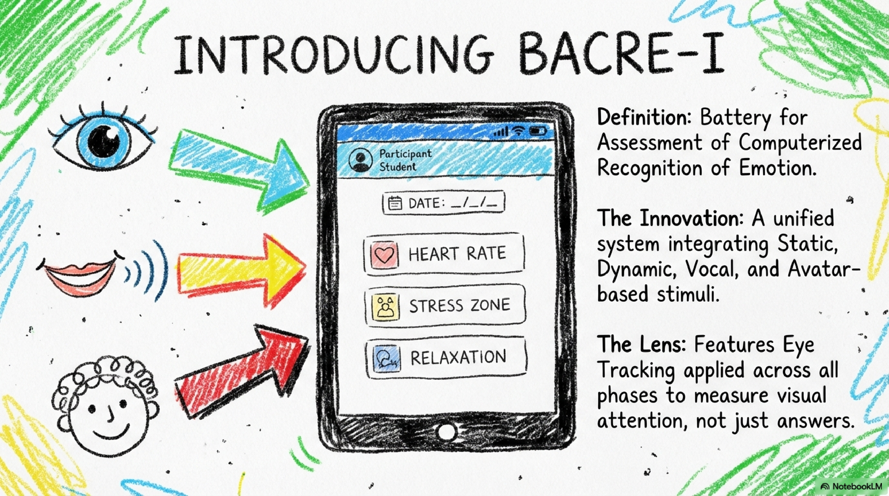

---

## Introducing BACRE-I

  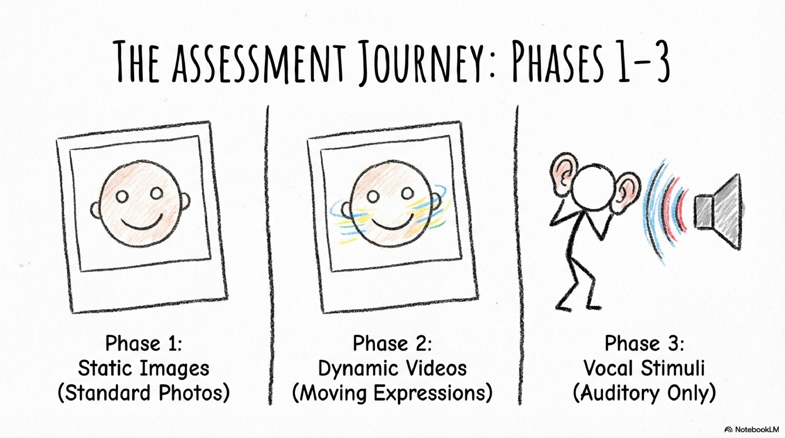

---

## Assessment Architecture

  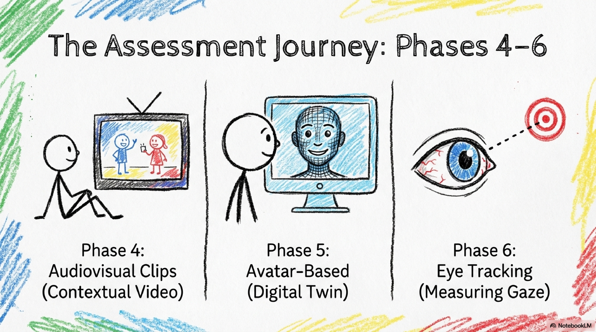

  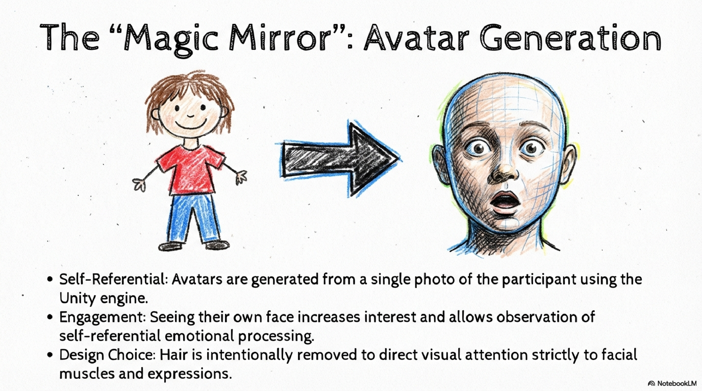

---

## Avatar-Based Self-Referential System

  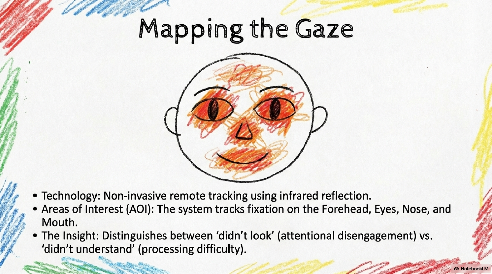

Participants interact with a personalized digital twin generated from their own facial image, increasing engagement and ecological validity.

---

## Objective Gaze Mapping

  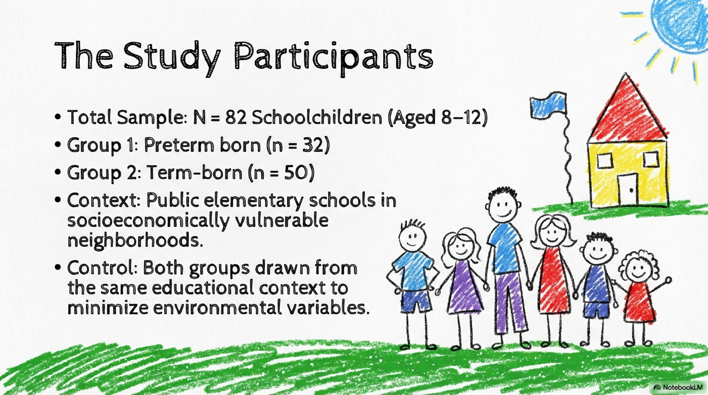

Infrared eye-tracking technology enables the measurement of:

- Areas of Interest (eyes, forehead, nose, mouth)  
- Fixation density  
- Reaction time  
- Visual attention dispersion  

This allows differentiation between attentional disengagement and emotional processing difficulty.

---

## Empirical Validation

  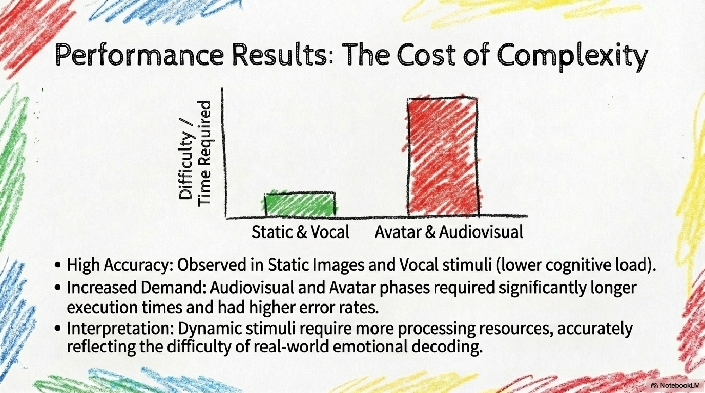

- **N = 82** schoolchildren  
- Preterm group (n = 32)  
- Term-born group (n = 50)  
- Public elementary schools  

---

## Performance Across Modalities

  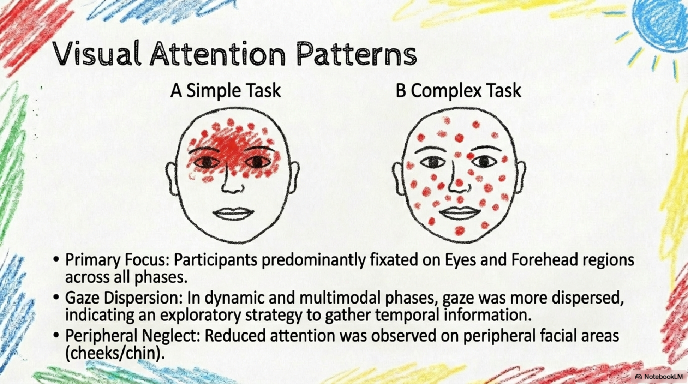

Dynamic and multimodal tasks demonstrate higher cognitive demand, reflecting more realistic emotional decoding scenarios.

---

## Visual Attention Patterns

  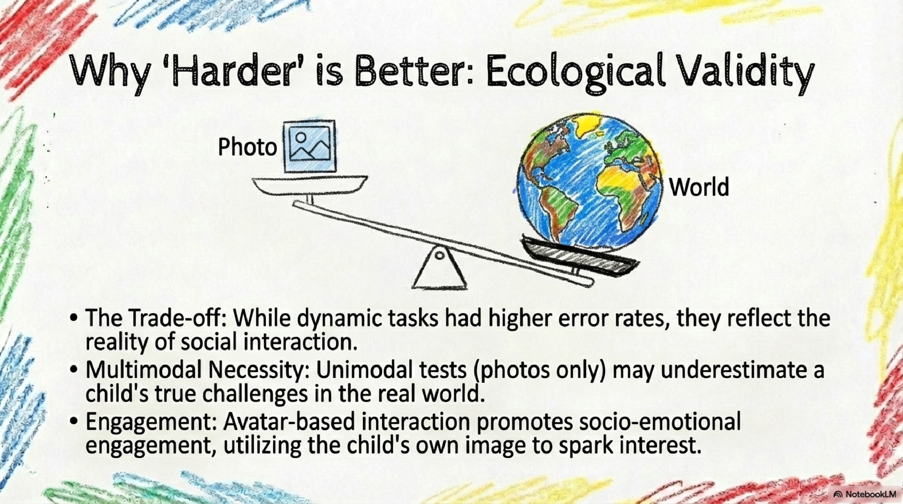

Primary fixation patterns concentrate on the eyes and forehead regions, with increased dispersion during multimodal stimuli.

---

## Ecological Validity

  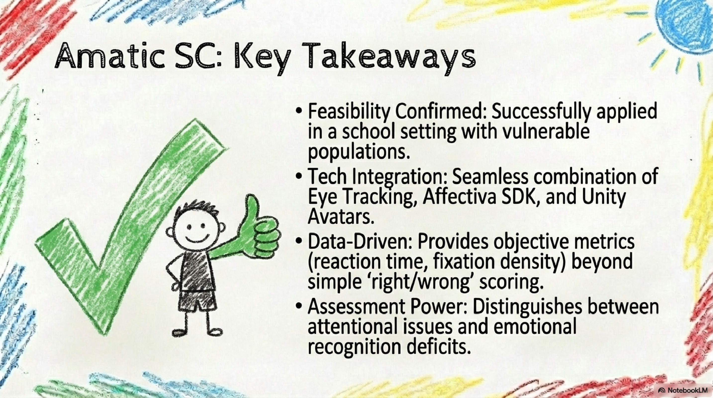

More complex tasks better approximate real-world socio-emotional interactions.

---

## Key Contributions

  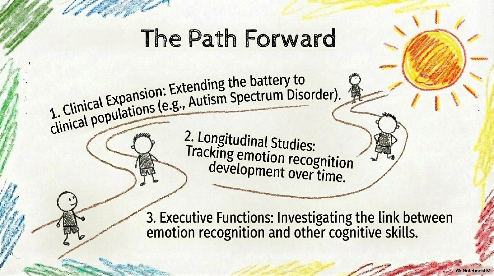

- Integrated multimodal assessment framework  
- Objective gaze-based emotional metrics  
- School-based feasibility validation  
- Scalable Unity-based architecture  

---

## Future Directions

  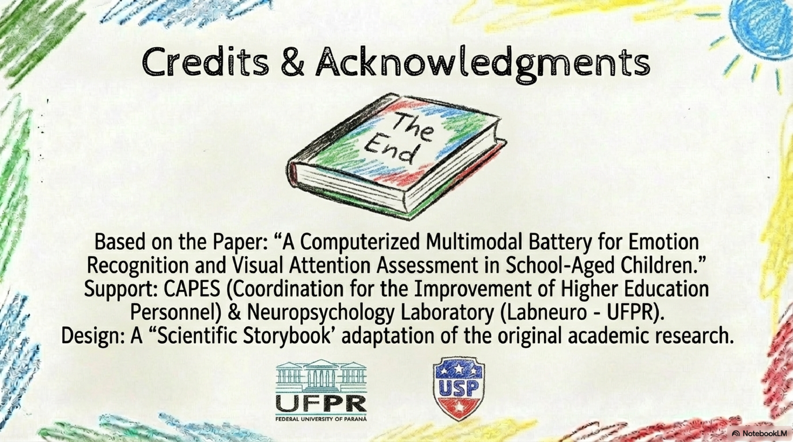

- Clinical validation (e.g., Autism Spectrum Disorder)  
- Longitudinal developmental tracking  
- Integration with executive function measures  
- Expansion to mobile environments  

---

## Demonstration & System Interface

Desktop and Mobile system screens + full demonstration video:

🔗 **Google Drive Folder**  
https://drive.google.com/drive/folders/1OYfumcsPjnzUJOme-HqGnWTM-SX3VQrj?usp=sharing  

---

## Credits & Acknowledgements

Based on the paper:

*A Computerized Multimodal Battery for Emotion Recognition and Visual Attention Assessment in School-Aged Children.*

Support:

- CAPES – Coordination for the Improvement of Higher Education Personnel  
- LabNeuro – Neuropsychology Laboratory (UFPR)  

Design:

- Scientific Storybook adaptation of the original academic research  

---

## Authors

**Tiago Mota de Oliveira**  
**Claudemir Casa**

Federal University of Paraná (UFPR)  
LabNeuro – Neuropsychology Laboratory  
